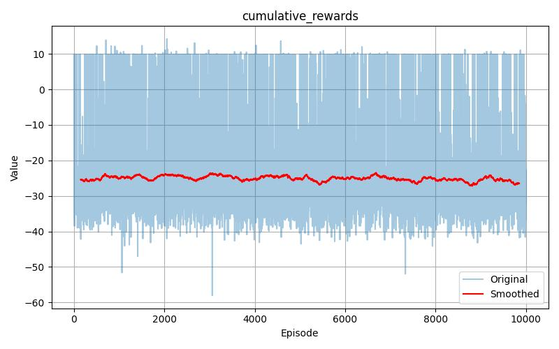
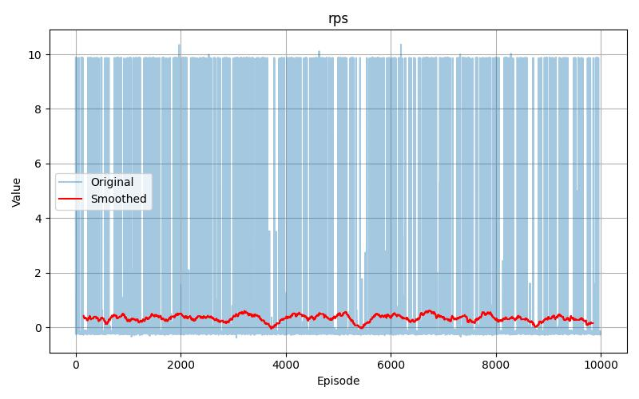
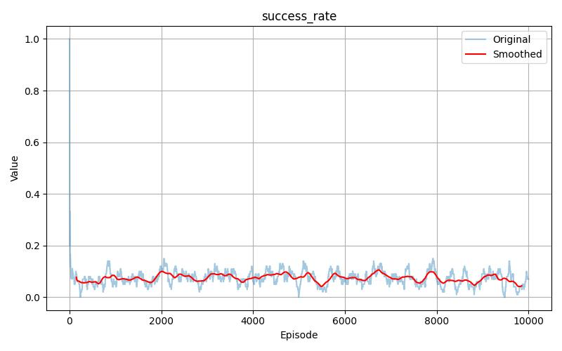
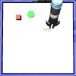
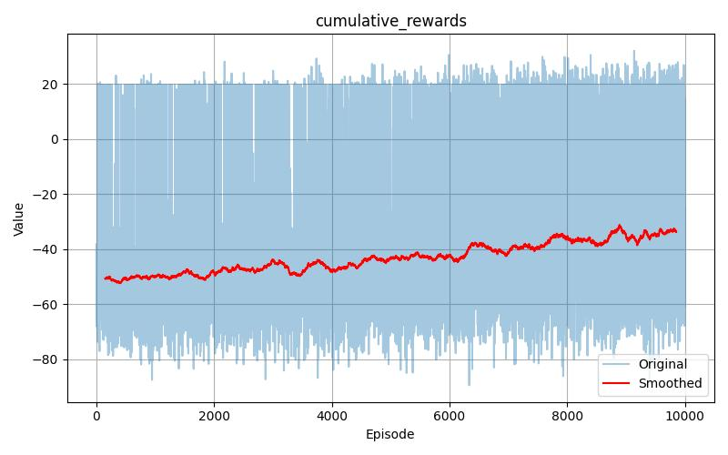
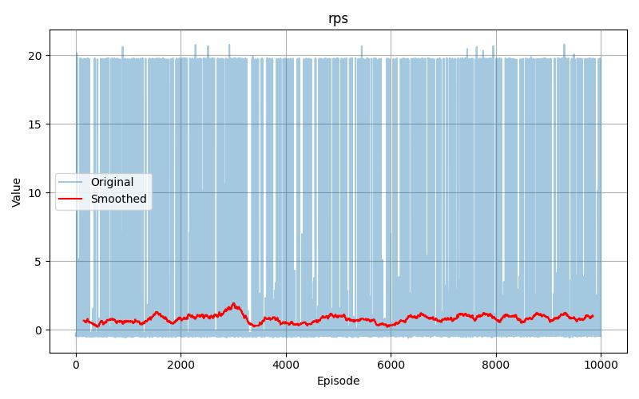
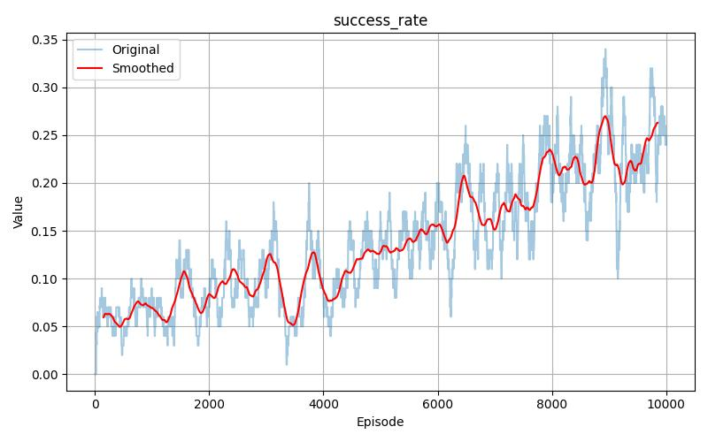

# Homework 3

Please install the required libraries listed in the `requirements.txt` file. The project consist of
two methods: policy gradient and soft actor critic. Training operations are held for 10000 episodes for each method. You can run the `mlflow ui` command to showcase the previous experiment
metrics in your localhost. It also gives descriptions about the hyperparameters. The `visualize.py` script is used to acquire the shown the graphs here. 

## Policy Gradient

Implementations are in the `homework3.py` file. The `train()` function can be used to imitate the training phase. Below are the smoothed and original values for the cumulative rewards, reward per steps, and success rates.

As it is seen from the graphs, the model couldn't learn how to act in the given environment. Below gif shows an example run with the trained model parameters.

## Soft Actor Critic

Implementations are in the `homework3_sac.py` file. The `train()` function can be used to imitate the training phase. Below are the smoothed and original values for the cumulative rewards, reward per steps, and success rates.

As it is seen from the graphs, the provided model structure is not adequate for the system to learn acting appropriately.
The cumulative reward values increased slowly in the training phase, and the success rate reached to 25%. But the model still fails to
build a proper policy. A failure example is shown in the below gif.

